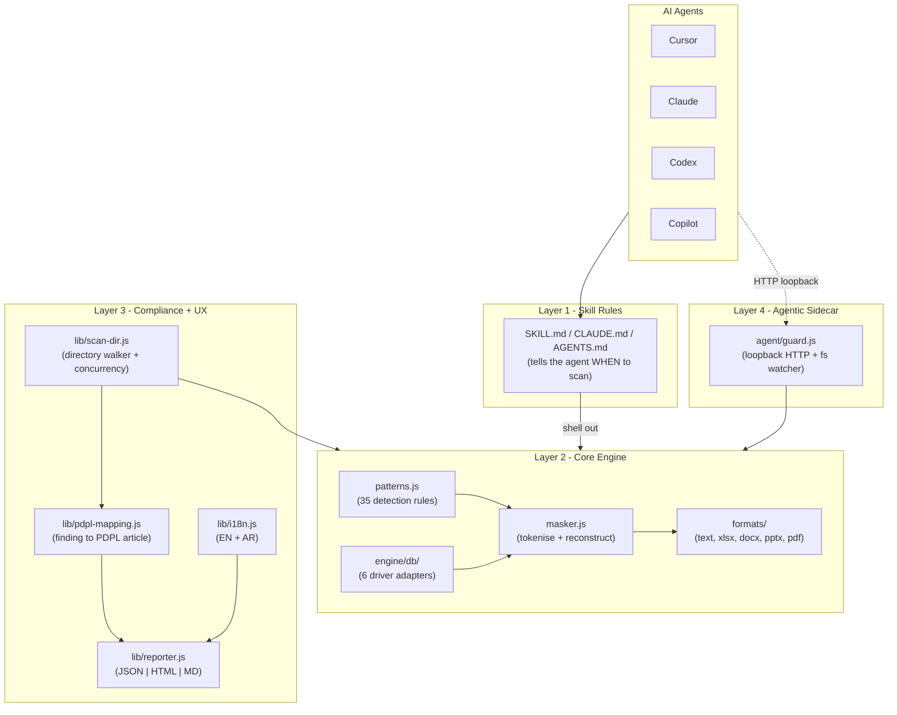
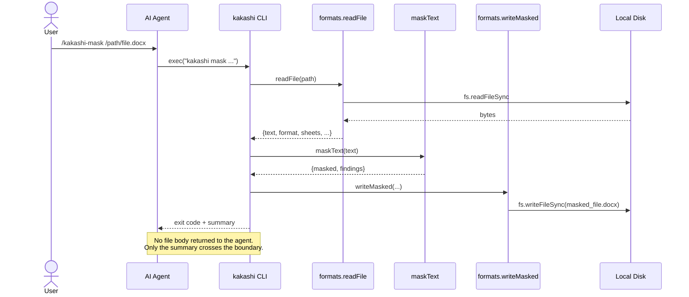
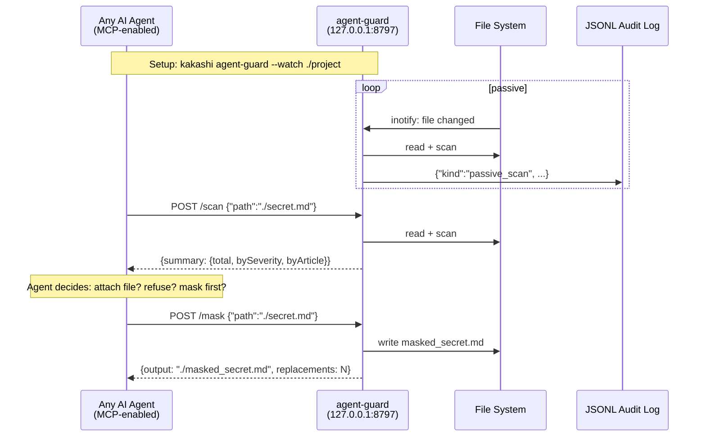

# Kakashi Architecture (v1.1)

> This document is the technical evidence layer for the "AI maturity" criterion of the UAE AI Award submission. Every claim in [UAE_AI_AWARD_SUBMISSION.md](UAE_AI_AWARD_SUBMISSION.md) is backed by the components documented below.

---

## 1. Overview

Kakashi is a four-layer system:



---

## 2. Data-flow diagrams

### 2.1 File masking (the classic path)



### 2.2 Database masking

```mermaid
sequenceDiagram
  actor User
  participant CLI as kakashi CLI
  participant Router as db/index.js
  participant Driver as pg / mysql / mongo / ...
  participant Remote as Remote DB
  participant Msk as maskText
  participant Disk

  User->>CLI: kakashi db-mask "postgres://..." -q "SELECT ..."
  CLI->>Router: inferDriver(conn) + streamMasked
  Router->>Driver: query(conn, sql)
  Driver->>Remote: TCP + TLS (client-side)
  Remote-->>Driver: rows
  loop for each row
    Driver-->>Router: row
    Router->>Msk: maskText(JSON.stringify(row))
    Msk-->>Router: masked row + findings
    Router-->>CLI: {row, masked, findings}
    CLI->>Disk: write masked_query.jsonl
  end
  Note over Driver,Remote: Only Kakashi sees the raw rows;<br/>the agent NEVER sees them.
```

### 2.3 agent-guard sidecar



---

## 3. Module reference (v1.1)

### 3.1 Core engine

| Module | Purpose | Public API |
| --- | --- | --- |
| [src/engine/patterns.js](../src/engine/patterns.js) | 35 detection patterns, checksum helpers (Luhn, Emirates-ID, IBAN) | `PATTERNS`, `luhnCheck`, `isValidEmiratesId`, `isValidIban` |
| [src/engine/masker.js](../src/engine/masker.js) | Tokenise + reconstruct | `maskText(text, opts)` |
| [src/engine/formats/](../src/engine/formats/) | Per-format read/write | `readFile`, `writeMasked` |
| [src/engine/db/](../src/engine/db/) | Client-side DB masking | `streamMasked(conn, query, opts)` |

### 3.2 Compliance & UX

| Module | Purpose | Public API |
| --- | --- | --- |
| [src/lib/pdpl-mapping.js](../src/lib/pdpl-mapping.js) | Map every finding to PDPL articles + severity | `summarize(findings)`, `enrich(finding)` |
| [src/lib/reporter.js](../src/lib/reporter.js) | Render JSON/HTML/Markdown compliance reports | `renderJson`, `renderHtml`, `renderMarkdown` |
| [src/lib/scan-dir.js](../src/lib/scan-dir.js) | Async concurrent tree scan | `scanDirectory(root, opts)` |
| [src/lib/i18n.js](../src/lib/i18n.js) | English / Arabic strings | `t(key, vars)`, `resolveLang(explicit)` |
| [src/lib/stats.js](../src/lib/stats.js) | Cumulative session stats | `loadStats`, `recordMask` |

### 3.3 Agentic sidecar

| Module | Purpose | Public API |
| --- | --- | --- |
| [src/agent/guard.js](../src/agent/guard.js) | Loopback HTTP daemon + fs watcher | `start(opts)`, `scanFile`, `maskFile` |

### 3.4 Guardian (v1.2)

The autonomous protection loop. Orchestrates the layers above; adds no detection or
transformation capability of its own. Runs in-process — no daemon required. See
[AGENTIC_ARCHITECTURE.md](AGENTIC_ARCHITECTURE.md) for the full design.

| Module | Purpose | Public API |
| --- | --- | --- |
| [src/guardian/index.js](../src/guardian/index.js) | The agent loop | `runGuardian(opts)`, `DECISIONS` |
| [src/guardian/classes.js](../src/guardian/classes.js) | 35 pattern ids → 9 sensitivity classes | `classOf`, `patternIdsFor` |
| [src/guardian/state.js](../src/guardian/state.js) | Run memory; drives replanning | `GuardianState`, `STATUS` |
| [src/guardian/observe.js](../src/guardian/observe.js) | Sensor over `maskText` + `summarize`; metadata only | `observe(path)` |
| [src/guardian/risk.js](../src/guardian/risk.js) | Contextual score + reason codes | `RiskEngine.assess` |
| [src/guardian/policy.js](../src/guardian/policy.js) | Deterministic authority over any planner | `PolicyGuard.validate` |
| [src/guardian/planner.js](../src/guardian/planner.js) | Minimum-necessary plan + escalation ladder | `Planner.createPlan` |
| [src/guardian/executor.js](../src/guardian/executor.js) | Authorised plan → existing engine | `Executor.execute` |
| [src/guardian/verifier.js](../src/guardian/verifier.js) | Re-reads and re-scans the artifact | `Verifier.verify` |
| [src/guardian/audit.js](../src/guardian/audit.js) | Value-free decision events (JSONL) | `buildEvent`, `write` |
| [src/guardian/paths.js](../src/guardian/paths.js) | realpath / containment / symlink checks | `resolveResource`, `resolveOutput` |

---

## 4. Threat model (STRIDE)

| Category | Threat | Mitigation |
| --- | --- | --- |
| **Spoofing** | Malicious agent pretends to be a legitimate MCP client to query agent-guard | Guard binds `127.0.0.1` only; hard-check on `req.socket.remoteAddress` refuses non-loopback origins even if the OS routes packets locally. No public interface possible without CLI flag override. |
| **Tampering** | Attacker modifies `patterns.js` to disable a detection rule | Kakashi is installed via npm with signed publisher (`@muhammadatef`). Users can freeze the version in `package.json`. Enterprise mode can be run from `node_modules/@muhammadatef/kakashi` with SHA validation. |
| **Repudiation** | User denies having exposed a credential that Kakashi flagged | Compliance report + agent-guard JSONL log create an audit trail with UTC timestamps. Downstream: DPO can prove that a warning was surfaced at time T. |
| **Information Disclosure** | Kakashi itself leaks the secrets it detects | Default output is counts-only. Previews are opt-in via `--verbose`. `audit` is deliberately verbose and documented as such. No telemetry, no phone-home, no error reporting to third parties. |
| **Denial of Service** | Enormous input file exhausts memory | Streaming per-row for DB. Per-file try/catch in `scan-dir` so one bad file doesn't crash the run. `--limit N` on db-scan enforces a row cap (default 10 000). |
| **Elevation of Privilege** | Attacker leverages the daemon's file-read capability to read files outside the watched dir | Guard only reads paths the caller asks it to scan, via the same `formats.readFile` that respects OS-level permissions. Guard has no `setuid` or elevated permissions. |

---

## 5. Trust boundary

The single most important line of code in Kakashi is where the file body **stops** travelling to the AI.

```
┌────────────────────── USER DEVICE ──────────────────────┐
│                                                          │
│  Local Disk / Local DB                                   │
│         │                                                │
│         ▼                                                │
│  Kakashi (formats.readFile / db.streamMasked)            │
│         │                                                │
│         ▼                                                │
│  Kakashi (maskText → tokens)                             │
│         │                                                │
│         ▼                                                │
│  Kakashi (writes masked_file.docx OR JSON summary)       │
│         │                                                │
│         │  <──── THIS is the trust boundary.             │
│         │       Only masked artifact + summary counts    │
│         │       cross it in the default flow.            │
│         ▼                                                │
│  AI Agent (Cursor / Claude / Copilot / Codex / ...)      │
│         │                                                │
└─────────┼────────────────────────────────────────────────┘
          ▼
    External LLM API (OpenAI, Anthropic, Google, ...)
```

The trust boundary is enforced by four defaults:

1. `scan` prints counts only (`--verbose` opt-in for previews)
2. `mask` writes to disk, never streams to stdout by default
3. `audit` is documented as "deliberately verbose" and only invoked explicitly
4. agent-guard's `/scan` API returns PDPL summary — never raw values

---

## 6. Agent integration protocol

Any AI agent capable of shelling out or making local HTTP calls can integrate with Kakashi.

### 6.1 Shell-based agents (Claude Code, Cursor, Codex CLI)

Six slash commands are installed as agent-scoped skills:

```
/kakashi              activate privacy mode
/kakashi-scan <path>  counts only (agent-safe)
/kakashi-mask <path>  write masked_<file>
/kakashi-audit <path> deliberately verbose
/kakashi-stats        cumulative
/kakashi-list         all detection patterns
```

The agent shells out to `kakashi <subcommand>` and reads stdout. Default counts-only output means no raw secrets ever enter the agent's LLM context.

### 6.2 HTTP-based agents (MCP-enabled)

```http
GET  http://127.0.0.1:8797/health
POST http://127.0.0.1:8797/scan   { "path": "..." }
POST http://127.0.0.1:8797/mask   { "path": "...", "output": "..." }
```

Suggested MCP wrapper (pseudo-code — build as a v1.2 companion package):

```js
// mcp-kakashi/index.js
export const kakashi_scan = {
  description: "Scan a file for sensitive data using local Kakashi guard.",
  parameters: { path: "string" },
  handler: async ({ path }) => {
    const r = await fetch("http://127.0.0.1:8797/scan", {
      method: "POST",
      body: JSON.stringify({ path }),
    });
    return r.json();
  },
};
```

Agents can then require:

```
Rule: before attaching a file with an @-mention, first call
      the kakashi_scan tool. If summary.total > 0, either call
      kakashi_mask first, or refuse to attach.
```

---

## 7. OECD & UAE ethical AI alignment

Kakashi is a rule-based safety layer, not an AI model. It nonetheless aligns explicitly with the five OECD Principles for Trustworthy AI and their UAE-adopted equivalents:

| Principle | How Kakashi implements it |
| --- | --- |
| **Inclusive growth, sustainable development, well-being** | MIT-licensed, free at point of use, no per-seat cost. Makes agentic AI accessible without excluding smaller organisations. |
| **Human-centred values & fairness** | Native Emirates-ID + Arabic-name detection. Bilingual CLI. No user is a second-class citizen of the tool. |
| **Transparency & explainability** | Every detection is a readable regex. `list-patterns` prints every active rule. `audit` gives full traceability. |
| **Robustness, security & safety** | Threat model documented above. 101 automated tests. Zero network calls. Loopback-only daemon. |
| **Accountability** | JSONL audit log, PDPL-mapped compliance reports, cumulative session stats. Everything is inspectable and evidentiary. |

UAE-specific overlays:

| UAE guidance | Kakashi coverage |
| --- | --- |
| **UAE AI Ethics Principles** (fairness, transparency, accountability, privacy, security, explainability, robustness, human-centricity, sustainability) | All nine addressed as above; privacy is Kakashi's core value proposition. |
| **UAE PDPL** (Federal Decree-Law 45 of 2021) | See [src/lib/pdpl-mapping.js](../src/lib/pdpl-mapping.js) — every detection class mapped to specific articles. |
| **UAE Data Office** | Compliance report format designed to be handed directly to DPOs / Data Office as audit evidence. |
| **UAE Cybersecurity Strategy** | Zero-trust posture: no network calls, no cloud dependency, no telemetry. |

---

## 8. Exit codes & CI integration

| Code | Meaning | CI usage |
| --- | --- | --- |
| 0 | Success, no findings | Pass |
| 1 | Findings detected | Fail the pipeline; the JSONL/JSON report shows what and where |
| 2 | Error (file not found, driver missing, etc.) | Investigate before shipping |

`kakashi guard` returns a decision rather than a finding count:

| Code | Meaning | CI usage |
| --- | --- | --- |
| 0 | `ALLOW` / `ALLOW_WITH_TRANSFORMATION` | Safe to release; use the artifact |
| 2 | Error — failed closed, nothing written | Investigate |
| 3 | `REQUIRE_APPROVAL` — nothing written | Route to a human |
| 4 | `BLOCK` — nothing written | Stop |

GitHub Actions example:

```yaml
- name: Kakashi privacy scan
  run: |
    npm install -g @muhammadatef/kakashi
    kakashi scan-dir . -f json -o kakashi-report.json
- name: Upload compliance report
  if: always()
  uses: actions/upload-artifact@v4
  with:
    name: kakashi-report
    path: kakashi-report.json
```

---

## 9. Version history

| Version | Date | Highlights |
| --- | --- | --- |
| 1.0.0 | 2026-05 | Initial: patterns, masker, 5 formats, CLI, 20+ agent skills |
| **1.1.0** | **2026-09** | **UAE patterns (Emirates ID + IBAN + Arabic names), PDPL mapping, scan-dir with HTML/JSON/MD reporter, DB masking (6 drivers), agent-guard daemon, bilingual CLI, 101 tests** |

---

## Related

- [../README.md](../README.md) — English overview
- [../README.ar.md](../README.ar.md) — Arabic overview
- [UAE_AI_AWARD_SUBMISSION.md](UAE_AI_AWARD_SUBMISSION.md) — award submission
- [UAE_PILOT_KIT.md](UAE_PILOT_KIT.md) — pilot outreach kit
- [DEMO_VIDEO_UAE.md](DEMO_VIDEO_UAE.md) — video production kit
- [CONTRIBUTING.md](CONTRIBUTING.md)
