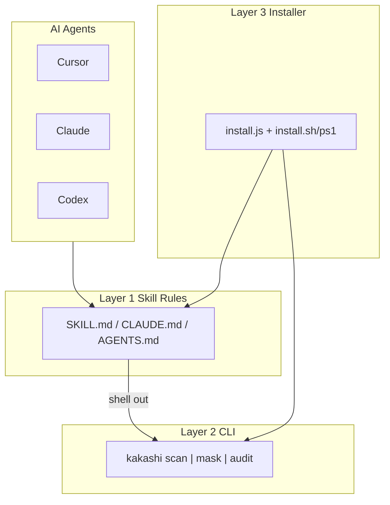

# Kakashi Architecture

## Overview

Kakashi uses a three-layer skill architecture: agent rules tell the assistant *when* to scan, the CLI does the actual scanning and masking, and the installer wires everything together across 20+ AI agents.



## Layer 1: Skill Rules

Markdown files placed in agent config directories tell the AI to scan before sharing files.

| Agent | Location |
|-------|----------|
| Claude Code | `~/.claude/CLAUDE.md` (marker block) |
| Cursor | `~/.cursor/rules/kakashi.mdc` |
| Codex | `~/.codex/AGENTS.md` |
| Windsurf | `.windsurf/rules/kakashi.md` |
| Cline | `.clinerules/kakashi.md` |
| Copilot | `.github/copilot-instructions.md` |

Single source of truth: `src/rules/kakashi-activate.md`

## Layer 2: CLI Engine

### Pattern registry (`src/engine/patterns.js`)

Each pattern has:
- `id` — unique slug
- `label` — display name
- `cat` — `id` | `pii` | `cred`
- `rx` — RegExp with global flag
- `validate` — optional false-positive filter
- `fakeValues` — replacements for `--mode fake`

### Masker (`src/engine/masker.js`)

`maskText(text, options)` returns `{ masked, findings }`.

**Algorithm:**
1. Collect all regex matches from active patterns
2. Sort by start position, then length (longer wins at same position)
3. Resolve overlaps (non-overlapping set)
4. Assign consistent replacements (same value → same token)
5. Apply replacements end-to-start to preserve offsets

**Modes:**
| Mode | Output |
|------|--------|
| `typed` | `[EMAIL_1]`, `[OPENAI_KEY_2]`, `[DB_CONN_3]` |
| `redact` | `[REDACTED]` |
| `fake` | Realistic fake values |

### Format handlers (`src/engine/formats/`)

| Format | Library | Notes |
|--------|---------|-------|
| Text/Code | native fs | 40+ extensions |
| xlsx | SheetJS | Cell-level replacement |
| docx | JSZip | XML `<w:t>` tags |
| pptx | JSZip | XML `<a:t>` tags |
| pdf | pdf-parse | Text extract → `_masked.txt` |

## Layer 3: Installer

`bin/install.js` detects installed agents and drops config files.

**Marker blocks** for clean uninstall:

```html
<!-- kakashi-begin -->
...skill content...
<!-- kakashi-end -->
```

**Idempotent:** re-running install skips if markers already present (unless `--force`).

## Exit codes

| Code | Meaning |
|------|---------|
| 0 | Success, no findings |
| 1 | Findings detected (CI-friendly) |
| 2 | Error |

## Stats

Cumulative usage stored in `~/.kakashi/stats.json`.

## Security constraints

- Zero network calls during scan/mask
- Original files never overwritten by default
- All processing local to the user's machine

## Related

- [CONTRIBUTING.md](CONTRIBUTING.md)
- [../INSTALL.md](../INSTALL.md)
